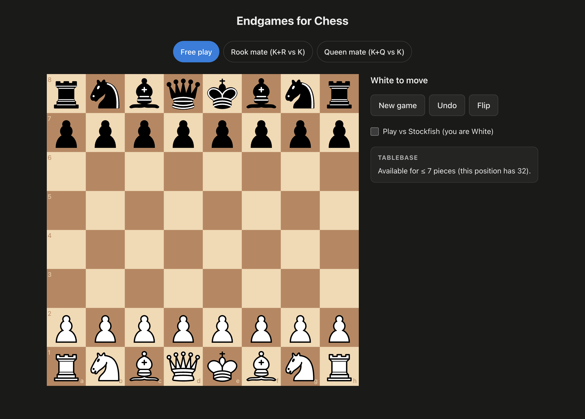
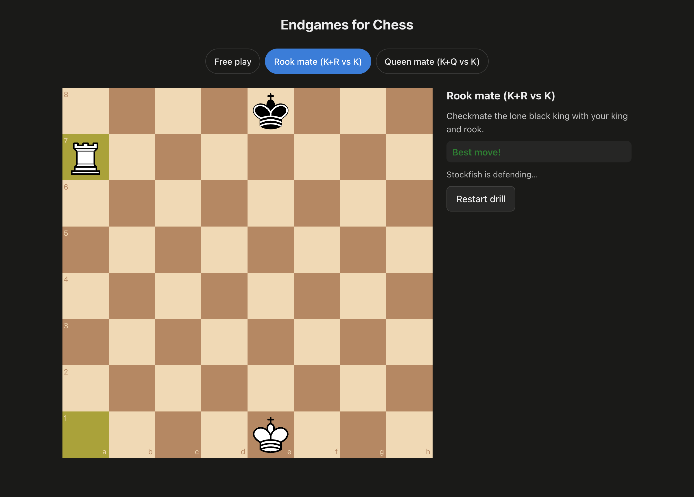
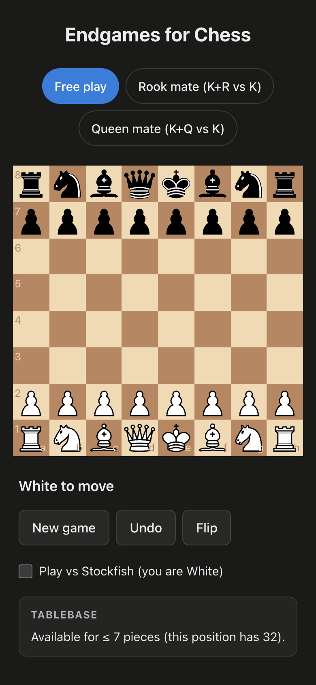

# Endgames for Chess

A chess **endgame trainer** that grows into a full trainer. Play on a real board with full rules,
practise against **Stockfish**, and drill classic endgames where every one of your moves is graded
against **perfect tablebase play**.



---

## Features

- ♟️ **Full legal chess** — legal-move highlighting, checks, checkmate, stalemate, and all draw
  conditions (via [`chess.js`](https://github.com/jhlywa/chess.js)).
- 🖱️ **Tap-to-move and drag** — mobile-first board interaction, not just desktop dragging.
- 🤖 **Play vs Stockfish** — the world's strongest open-source engine runs entirely in your
  browser (WebAssembly, in a Web Worker) as your opponent.
- 🎯 **Graded endgame drills** — practise K+R vs K and K+Q vs K. Stockfish defends while the
  **Lichess tablebase** grades every move: _Best move!_, _good_, _inaccuracy_, or _blunder_.
- 📊 **Tablebase readout** — for any position with ≤ 7 pieces, see the theoretical result and
  distance to mate.
- 📱 **Installable PWA** — responsive, touch-first, works offline, and installs to your phone's
  home screen. One codebase, ready to wrap for the App Store / Play Store later.

## Screenshots

| Endgame drill with move grading                                                                             | Mobile layout                                                                                |
| ----------------------------------------------------------------------------------------------------------- | -------------------------------------------------------------------------------------------- |
|  |  |

## Tech stack

| Concern             | Choice                                                    |
| ------------------- | --------------------------------------------------------- |
| Rules engine        | `chess.js` (behind a thin swappable interface)            |
| Board UI            | `react-chessboard` v5                                     |
| Opponent / analysis | Stockfish 18 (lite, single-threaded WASM) in a Web Worker |
| Endgame grading     | Lichess Tablebase API                                     |
| Framework           | React 19 + TypeScript                                     |
| Tooling             | [Vite+](https://viteplus.dev) (`vp`) in a pnpm monorepo   |
| Styling             | Plain CSS Modules, responsive + touch-first               |

## Getting started

Prerequisites: **Node ≥ 22.12** and **pnpm**.

```bash
pnpm install      # install deps (also copies the Stockfish engine into place)
pnpm dev          # start the dev server at http://localhost:5173
```

Other useful commands:

```bash
pnpm --filter chess-fe build   # production build (typecheck + bundle)
pnpm --filter chess-fe lint    # lint
pnpm ready                     # full gate: format + lint + typecheck + build
```

## Project structure

```
apps/chess-fe/               # the web app
  public/                    # PWA manifest, icon, service worker, Stockfish engine (gitignored)
  scripts/setup-engine.mjs   # copies the Stockfish WASM into public/ before dev & build
  src/
    chess/                   # rules engine wrapper + FEN helpers (game.ts, fen.ts, types.ts)
    engine/                  # Stockfish Web Worker + UCI parsing (stockfish.ts, uci.ts)
    tablebase/               # Lichess tablebase client (lichess.ts, types.ts)
    drills/                  # drill data + move grading (data.ts, grade.ts, types.ts)
    hooks/                   # React state hooks (use-chess-game, use-drill, …)
    components/              # board + panels (one component per file)
packages/utils/              # shared utilities
services/                    # future backend (auth, progress, multiplayer)
```

## How it works

The app is layered so pure logic stays UI-agnostic (and can later move into a shared package the
backend reuses):

1. **Rules** — `src/chess/game.ts` is the only module that touches `chess.js`; everything else
   talks to a small typed `ChessGame` interface.
2. **Engine** — `src/engine/stockfish.ts` boots Stockfish in a Web Worker and exposes an async
   `analyse(fen)` over the UCI protocol.
3. **Tablebase** — `src/tablebase/lichess.ts` looks positions up for perfect endgame results,
   degrading gracefully when offline.
4. **Drills** — `src/hooks/use-drill.ts` ties the board, the engine (as defender), and the
   tablebase (as grader) together into one training loop.

## Conventions

This repo enforces small, readable files (see [`CLAUDE.md`](CLAUDE.md)):

- **One component per file**, each source file ≤ 300 lines (hard cap 500) — enforced by a
  file-size hook.
- **Kebab-case filenames** — enforced by a git pre-commit hook
  (`scripts/check-kebab-case.mjs`); conventional docs and dotfiles are exempt.

## Roadmap

- **Phase 1 — endgame foundation** ✅ — board, rules, Stockfish opponent, graded drills, PWA.
- **Phase 2 — bots & full trainer** — multiple difficulty bots (Stockfish skill levels) and
  full-board analysis / coaching.
- **Phase 3 — online play** — a backend for accounts and progress, plus realtime multiplayer,
  reusing the same rules engine server-side for move validation.

Cross-platform plan: web-first → PWA → Capacitor wrap for App Store / Play Store — one codebase
throughout.

## Known issues

#### 1. No way to load a custom FEN in Free Play

`useChessGame.loadFen()` exists ([hooks/use-chess-game.ts](apps/chess-fe/src/hooks/use-chess-game.ts))
but no UI calls it, so the tablebase panel is only reachable by playing a game down manually.

#### 2. `skillLevel` is fully wired but never used

Stockfish's difficulty option works end-to-end, but no caller
([free-play.tsx](apps/chess-fe/src/components/free-play.tsx),
[use-drill.ts](apps/chess-fe/src/hooks/use-drill.ts)) ever passes a value — always full strength.

#### 3. Move grading only works ≤ 7 pieces

`gradeMove()` ([drills/grade.ts](apps/chess-fe/src/drills/grade.ts)) needs a tablebase result, so
any position with more pieces can't be graded at all.

This is an open-source effort — if you'd like to contribute, these are good first bugs to try
fixing. 😊
